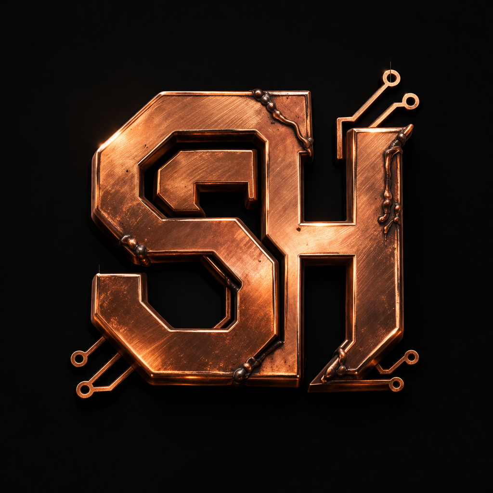

# Second Hash — Refabricated Mining Hardware

<p align="center">
  
</p>

<p align="center">
  <strong>Every miner deserves a second hash.</strong><br>
  The first refabrication vendor for <a href="https://hashcash.club">Club HashCash</a> on Avalanche.
</p>

---

## What is Second Hash?

Second Hash is a new hardware vendor brand designed for the **Club HashCash** ecosystem. Unlike existing vendors that manufacture new miners from scratch, Second Hash is the first and only **refabrication vendor** — we take retired, obsolete miner NFTs and rebuild them into tuned, efficient machines that earn again.

No new silicon. No waste. Just better engineering.

## The Problem

The Club HashCash network has a growing pile of dead hardware. As emission halvings make older miners unprofitable, they accumulate in player wallets — taking up space, listed at prices nobody will pay, and contributing nothing to the network. **66% of Lv.1 facilities are offline.** There is a 200x efficiency gap between the weakest USB miner (0.010 MH/W) and the latest flagship (2.000 MH/W).

## The Solution

Second Hash introduces a **Trade-In Program** that converts obsolete miners into competitive refabricated hardware:

- **Players trade in** 3–5 retired miner NFTs + an assembly fee in hCASH
- **Old miners are permanently burned** — removing dead NFTs from circulation
- **A new SH-series miner is minted** — tuned for current network conditions

This creates three simultaneous benefits: NFT supply compression, hCASH deflationary pressure, and dormant player re-engagement.

## Product Lineup

### Phase 1 Miners (Current)

| Model | Codename | Hashrate | Power | Efficiency | Source |
|-------|----------|----------|-------|------------|--------|
| SH-R1 | Reclaim | 40 MH/s | 150W | 0.267 MH/W | CPU-class salvage |
| SH-R2 | Reforge | 120 MH/s | 400W | 0.300 MH/W | GPU Gen-1 salvage |
| SH-X1 | Overhaul | 300 MH/s | 600W | 0.500 MH/W | Multi-vendor cross-match |

### Phase 1 Boost Modules

| Model | Codename | Effect | Mechanic |
|-------|----------|--------|----------|
| SH-B1 | Patch | -15% Power Draw | Burned on removal |
| SH-B2 | Splice | +10% Hashrate | Burned on removal |
| SH-B3 | Overclock | +8% Hash / -10% Power | Burned on removal |

### Phase 2 Roadmap (Tier B Salvage)

| Model | Codename | Efficiency | Status |
|-------|----------|------------|--------|
| SH-R3 | Refit | 0.625 MH/W | Specs coming soon |
| SH-R4 | Fuse | 0.667 MH/W | Specs coming soon |
| SH-X2 | Apex | 0.824 MH/W | Specs coming soon |
| SH-B4 | Surge | +20% Hashrate | Specs coming soon |
| SH-B5 | Regulate | -25% Power Draw | Specs coming soon |

### Phase 3 Vision

**SH-X3 "Zenith"** — targeting 1.0–1.2 MH/W, the theoretical limit of refabrication.

## Ecosystem Impact

- **NFT Compression**: Every SH miner permanently removes 3–5 dead NFTs from circulation
- **hCASH Burn**: Assembly fees (800–3,000 hCASH per unit) create sustained deflationary pressure
- **Player Retention**: Gives offline Lv.1 operators a reason to return — their dead inventory becomes upgrade material
- **Efficiency Bridge**: Fills the massive gap between Tier C obsolete hardware and Tier S flagships

## Deliverables

### Website
A fully responsive single-page product site showcasing all products, specifications, trade-in mechanics, and brand story.

**Open locally**: `site/index.html`

### Whitepaper
Comprehensive technical document covering the full product lineup, ecosystem analysis, and roadmap.

**Location**: `docs/Second_Hash_Whitepaper.pdf`

### Documentation
- `docs/project-overview.md` — Brand positioning and product specs
- `docs/game-data-analysis.md` — Full analysis of all 53 miners across 4 tiers
- `docs/product-roadmap-phase2-3.md` — Phase 2/3 roadmap with miner coverage analysis

### Visual Assets
- 11 photorealistic 3D product renders (Phase 1 + Phase 2)
- Brand logo and social media assets
- `visuals/` — AI image generation prompts and style guide

## Repository Structure

```
second-hash/
├── README.md
├── site/
│   ├── index.html              # Product website
│   └── images/                 # Product renders & branding
│       ├── SH-R1_Reclaim.png
│       ├── SH-R2_Reforge.png
│       ├── SH-X1_Overhaul.png
│       ├── SH-R3_Refit.png
│       ├── SH-R4_Fuse.png
│       ├── SH-X2_Apex.png
│       ├── SH-B1_Patch.png
│       ├── SH-B2_Splice.png
│       ├── SH-B3_Overclock.png
│       ├── SH-B4_Surge.png
│       ├── SH-B5_Regulate.png
│       ├── SH_Logo.png
│       ├── X-Logo.png
│       └── X-banner.png
├── docs/
│   ├── Second_Hash_Whitepaper.pdf
│   ├── project-overview.md
│   ├── game-data-analysis.md
│   └── product-roadmap-phase2-3.md
└── visuals/
    ├── ai-image-prompts.md
    ├── phase2-image-prompts.md
    └── x-account-setup.md
```

## Brand Identity

| Element | Value |
|---------|-------|
| Primary Color | Copper `#D4924A` |
| Secondary Color | Dark Copper `#B87333` |
| Background | Deep Black `#0A0C0F` |
| Display Font | Space Mono |
| Body Font | Inter |
| Tagline | "Every hash deserves a second chance." |

## Technical Notes

- The website is a single self-contained HTML file with embedded CSS and vanilla JavaScript — no build tools, no dependencies, no frameworks
- All product images are AI-generated photorealistic 3D renders with a unified visual style (warm amber gradient, copper rim lighting, brushed steel chassis)
- The whitepaper PDF is generated programmatically with a dark theme matching the website aesthetic

## Links

- [Club HashCash](https://hashcash.club)

---

<p align="center">
  <em>Built for the Club HashCash Hashathon 2026</em><br>
  <em>Hardware Supplier Track</em>
</p>
